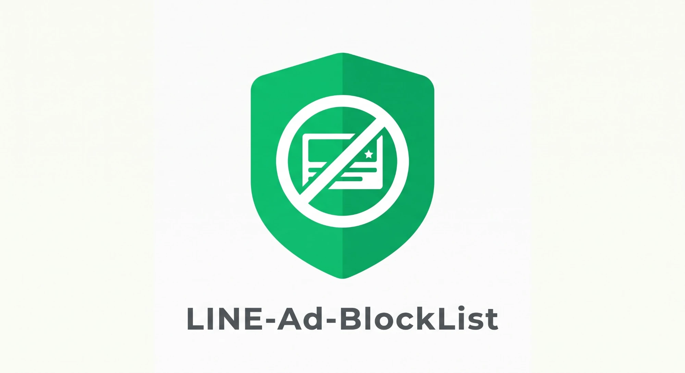

<p align="center">
  
</p>

# LINE-Ad-BlockList

LINEアプリのトーク一覧の上に出てくる広告やニュースを消すための、ブロックリストです。
iPhoneの「AdGuard」アプリ（またはAdGuard Home）に登録して使います。

- LINEの機能（トーク、通話、スタンプ、画像の送受信、LINE公式アカウントなど）はそのまま使えます
- ブロックするドメインは必要最低限にしています

## 消えるもの・消えないもの

| 場所 | 結果 |
|---|---|
| トーク一覧の上の広告 | 消えます（「新しいコンテンツはありません。」と表示されます） |
| トーク一覧の上のニュース（「注目」など） | 消えます |
| ホームタブ・ニュースタブの中の広告 | 画像は消えますが、広告の枠と文章は残ります |

## 使い方（iPhone）

### 1. AdGuardアプリを入れる

1. App Storeで「AdGuard」を検索して、インストールします
2. アプリを開き、案内に沿って初期設定をします

このリストは、AdGuardの **DNS保護** の機能を使います。DNS保護は有料版（AdGuard Pro／プレミアム）の機能です。購入方法はアプリ内の案内に従ってください。

### 2. DNS保護をオンにする

1. AdGuardアプリ下の **盾のマーク（保護）** を開きます
2. **DNS保護** をオンにします
3. 「VPN構成の追加」の確認が出たら、**許可** を選びます
   - iPhoneの中だけで動く仕組みで、通信が外部のVPNサーバーを通るわけではありません

### 3. このリストを登録する

1. **DNS保護** → **DNSフィルタリング** → **DNSフィルタ** を開きます
2. **フィルタを追加** をタップします
3. 次のURLを貼り付けて、追加します

```
https://raw.githubusercontent.com/minimal-enginner/LINE-Ad-BlockList/main/LINE-Ad-BlockList.txt
```

4. 一覧に「LINE-Ad-BlockList」が表示され、オンになっていれば完了です

アプリのバージョンによって、ボタンの名前や場所が少し違うことがあります。

### 4. LINEを開き直す

1. LINEのキャッシュを削除します（LINEの **設定 → トーク → データの削除** で「キャッシュ」を選ぶ）
   - トークの履歴や写真は消えません。念のため、画面の説明を確認してから実行してください
2. LINEを完全に終了してから、もう一度開きます

トーク一覧の上の広告が消えていれば成功です。

## 広告が消えないとき

- **AdGuardのDNS保護がオンになっているか** 確認してください
- **Wi-Fiアシストをオフにしてください**（iPhoneの **設定 → モバイル通信 → Wi-Fiアシスト**）
  - オンのままだと、Wi-Fiの電波が弱いときに自動でモバイル通信に切り替わり、その間はブロックが効かないことがあります
- **フィルタが最新か** 確認してください。DNSフィルタの画面で更新できます
- **LINEのキャッシュ** が残っていると、しばらく前の広告が表示されることがあります。手順4をもう一度試してください
- それでも消えない場合は、[Issues](https://github.com/minimal-enginner/LINE-Ad-BlockList/issues) で教えてください。表示された広告のスクリーンショットがあると助かります

## AdGuard Homeで使う場合

AdGuard Homeの管理画面で **フィルタ → DNSブロックリスト → ブロックリストを追加** から、上と同じURLを追加してください。

## 解説

画像付きの手順はこちら：[LINE広告にさよならを！｜AdGuard Proで簡単ブロック](https://minimalist-meme.com/line-ad-block-iphone/)

動画ver

[](https://youtu.be/p5uDziuqsq0?si=E5_LCGAIv_NtWADy)
